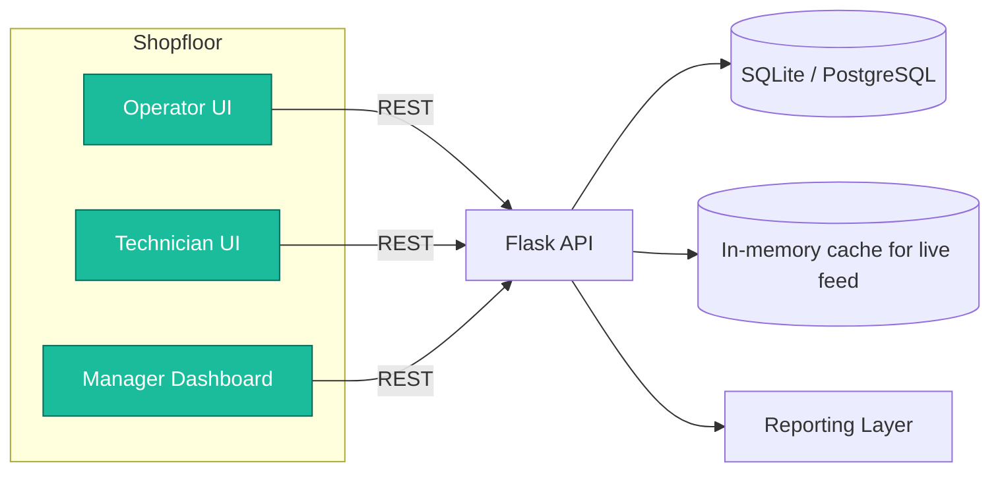

# 🏭 SmartFlow — Intelligent Production Reconfiguration Platform

> **Hackathon dla Małopolski 2025** · **Partner wyzwania:** ELPLC S.A. – _Inteligentny planer produkcji z dynamiczną rekonfiguracją_

<div align="center">
    
    
    
    
    
</div>

---

## 📚 Spis treści
1. [Co to jest SmartFlow](#-executive-summary)
2. [Dlaczego wygramy](#-dlaczego-wygramy-wyzwanie-elplc)
3. [Dla kogo jest ten system](#-mapa-interesariuszy-i-cele)
4. [Jak to działa](#-journeys-użytkowników)
5. [Architektura](#-blueprint-rozwiązania)
6. [Dane i API](#-dane--api-contract)
7. [Design i kolory](#-design-system---prosty-i-czytelny)
8. [Setup i instalacja](#-dev-playbook)
9. [Prezentacja i demo](#-pitch--demo-guide)
10. [Roadmapa](#-roadmapa-kpi-i-ryzyka)
11. [Przykłady API](#-appendix-sample-payloady-i-komendy)

---

## 🚀 Executive Summary

**SmartFlow** to system do automatycznej rekonfiguracji produkcji w odpowiedzi na awarie i zakłócenia.

**Problem (prawdziwy scenariusz ELPLC):**
> *"Fabryka produkuje części samochodowe. Wszystko idzie zgodnie z planem. Nagle kluczowa maszyna się psuje. Cały harmonogram się rozsypuje. Zlecenia się opóźniają, klienci czekają, koszty rosną."*

**Nasze rozwiązanie - "różne sposoby" (zgodnie z wyzwaniem):**

**Podejście #1: System reagujący w czasie rzeczywistym (MVP - teraz)**
- System **nie panikuje**, tylko **automatycznie reaguje** w czasie rzeczywistym
- **"Uwzględnia dostępność maszyn, czasy operacji, kolejność technologii"**:
  - Śledzi dostępność: `working`/`error`/`maintenance`
  - Rejestruje czasy: MTTR (Mean Time To Repair) dla każdej naprawy
  - Rozumie kolejność: zlecenie #1234 na CNC-01 wymaga 120 min, priorytet 1
- **Wizualizacja #1: Mapa zasobów** - Dashboard kafelkowy: 🟢 = działa, 🔴 = awaria, 🟡 = naprawa
- **Wizualizacja #2: Wykres Gantta** (Day 2) - Timeline zleceń pokazujący wpływ awarii
- Przy awarii: system przelicza dostępność i pokazuje zagrożone zlecenia

**Podejście #2: AI generująca plan od zera (Q1 2026 - roadmap)**
- **"Aplikacja, która generuje plan od zera"** wykorzystując:
  - **Algorytmy genetyczne** - optymalizacja przy ograniczeniach
  - **Reinforcement Learning** - uczenie optymalnych decyzji
- **"Przewidywanie awarii na podstawie danych archiwalnych"** (Q3 2026):
  - Machine Learning: LSTM/XGBoost analizuje historię MTTR/MTBF
  - Predykcja: "CNC-01 prawdopodobnie ulegnie awarii za 48h"

**Dla jury:** 
- ✅ **"Pokazane w praktyce"**: Działające MVP z mapą zasobów (każdy operator wie co robić)
- ✅ **Industry 4.0**: System reagujący w czasie rzeczywistym
- ✅ **Roadmap gotowa**: Wykres Gantta (Day 2), AI/algorytmy genetyczne (Q1 2026)
- ✅ **Made in Małopolska**: Projekt młodych inżynierów z regionu 🇵🇱

---

## 🎯 Dlaczego wygramy wyzwanie ELPLC

| Kryterium ELPLC (cytat z wideo)                                         | SmartFlow (co dostarczamy)                                                                                                                                                                                                                                |
| ----------------------------------------------------------------------- | --------------------------------------------------------------------------------------------------------------------------------------------------------------------------------------------------------------------------------------------------------- |
| *"System, który w takiej sytuacji nie panikuje"*                        | Mechanizm **One-Click Alert** + automatyczna zmiana statusu maszyny w czasie rzeczywistym (3 sekundy).                                                                                                                                                    |
| *"Automatycznie przelicza plan i proponuje nowy harmonogram"*           | MVP: manualny re-routing. **Roadmapa Day 2**: auto-rescheduling z heurystykami. **Q1 2026**: algorytmy genetyczne i reinforcement learning.                                                                                                               |
| *"Uwzględnia dostępność maszyn, czasy operacji, kolejność technologii"* | Status maszyn (`working`/`error`/`maintenance`) + **czasy operacji** (estimated_duration w tabeli orders) + **kolejność** (priority: 1=krytyczne, 2=wysokie, 3=normalne). System wie ile czasu zajmuje każde zlecenie i w jakiej kolejności je wykonywać. |
| *"Pokazać w prosty sposób operatorowi"*                                 | **Wizualizacja**: Dashboard kafelkowy (mapa zasobów) + timeline zleceń. Bez Exceli, bez tabel - kolor mówi wszystko: 🟢🟡🔴                                                                                                                                  |
| *"Przewidywać awarię na podstawie danych archiwalnych"*                 | Logujemy każdą awarię z timestampami → baza do predykcji (ML w roadmapie Q3 2026).                                                                                                                                                                        |
| *"To jest prawdziwe wyzwanie przemysłu 4.0"*                            | Responsive web app (Flask + HTML/CSS/JS) działająca w czasie rzeczywistym, gotowa do integracji z PLC (OPC-UA w roadmapie Q2 2026).                                                                                                                       |
| *"Najlepszy plan to taki, który potrafi się zmieniać"*                  | System **reaguje na zmiany**, nie trzyma się sztywnego planu. Każda awaria → natychmiastowa aktualizacja dashboardu i dostępności zasobów.                                                                                                                |

---

## 👥 Mapa interesariuszy i cele

| Persona                       | Ból                                                                        | Co im dajemy                                                                                             |
| ----------------------------- | -------------------------------------------------------------------------- | -------------------------------------------------------------------------------------------------------- |
| **Operator (Marek)**          | Musi zgłaszać awarie przez telefon/krzyk, traci czas na szukanie technika. | **MVP**: Widzi swoje 4 maszyny, przycisk "Zgłoś awarię". **Day 2**: +zleceń status.                      |
| **Technik (Ania)**            | Chaos zgłoszeń, brak priorytetyzacji.                                      | **MVP**: Kolejka zgłoszeń, przyciski Rozpocznij/Zakończ + rejestrowanie czasu naprawy.                   |
| **Kierownik produkcji (Ewa)** | Brak transparentności – dowiaduje się po fakcie.                           | **MVP**: Ogląda ten sam widok co operator (wszystkie maszyny). **Day 2**: +Wykres Gantta, KPI, sugestie. |
| **Zarząd / ELPLC**            | Szuka rozwiązania, które wejdzie szybko i pokaże ROI.                      | MVP działające w 48h plus roadmapa AI i integracji z PLC.                                                |

---

## 🧭 Jak to działa - Scenariusz z wyzwania ELPLC

### 🎬 "Fabryka części samochodowych" (live demo)

**Sytuacja wyjściowa:**
- 4 maszyny CNC pracują nad zleceniami: CNC-01 (Felga-L), CNC-02 (Felga-R), Press-A (Osłona), Press-B (Wspornik)
- Wszystkie kafelki ZIELONE → produkcja zgodnie z planem

**💥 Awaria ("nagle kluczowa maszyna się psuje"):**
1. Operator przy CNC-01 zauważa problem → klik **"ZGŁOŚ AWARIĘ"**
2. Wybiera typ: "Pęknięte narzędzie skrawające"
3. **System reaguje natychmiast (Industry 4.0):**
   - Kafelek CNC-01 → 🔴 CZERWONY
   - Status maszyny: `working` → `error`
   - Zlecenie "Felga-L" oznaczone jako **ZAGROŻONE**
   - Dashboard pokazuje: "3/4 maszyn dostępnych"

**🔧 Reakcja systemu ("nie panikuje, tylko przelicza plan"):**
- Technik Ania otwiera panel na tablecie
- Widzi zgłoszenie CNC-01 **na górze listy** (priorytet: krytyczne)
- Klik **"ROZPOCZNIJ NAPRAWĘ"** → kafelek → 🟡 ŻÓŁTY
- System aktualizuje: "CNC-01 w naprawie, estymowany czas: 15 min"

**✅ Powrót do normalności:**
- Ania kończy naprawę → klik **"ZAKOŃCZ"**
- Kafelek → 🟢 ZIELONY
- Maszyna wraca do puli dostępnych
- System zapisuje: MTTR = 17 minut, technik: Ania K.

**📊 Wartość ("pokazać w praktyce"):**
- Czas reakcji: z 20 min → **30 sekund**
- Operator od razu wie, co się dzieje (wizualizacja mapy zasobów)
- **MVP**: Kierownik widzi które maszyny są dostępne (dashboard kafelkowy)
- **Day 2**: System podpowie które zlecenie można przekierować + wykres Gantta
- Historia awarii → baza do predykcji (ML roadmap)

---

## 🏗️ Blueprint rozwiązania

### Architektura systemu



### Co jest w MVP (teraz) - "System reagujący w czasie rzeczywistym" (Podejście #1)

| Funkcja                             | Status | Opis (zgodnie z wyzwaniem ELPLC)                                     |
| ----------------------------------- | ------ | -------------------------------------------------------------------- |
| **Reakcja na awarie**               | ✅      | One-click alert → natychmiastowa zmiana statusu maszyny (3 sek)      |
| **Wizualizacja: Mapa zasobów**      | ✅      | Dashboard kafelkowy 🟢🟡🔴 - "każdy operator od razu wie, co ma zrobić" |
| **Panel Operatora**                 | ✅      | Lista maszyn + przycisk "Zgłoś awarię" + formularz opisu             |
| **Panel Technika (mobile-first)**   | ✅      | Kolejka zgłoszeń z priorytetami, przyciski "Rozpocznij"/"Zakończ"    |
| **Śledzenie czasu (MTTR)**          | ✅      | Automatyczne timestampy: zgłoszenie → start naprawy → zakończenie    |
| **Dostępność maszyn**               | ✅      | Status `working`/`error`/`maintenance` wpływa na widok dostępności   |
| **Baza danych (foundation dla AI)** | ✅      | SQLite z pełną historią awarii (timestamp, opis, MTTR) → dane do ML  |
| **API REST**                        | ✅      | 4 endpointy dla integracji z innymi systemami                        |
| **Responsywność (Industry 4.0)**    | ✅      | Działa na PC, tablet, telefon - zero instalacji                      |

### Co będzie później - "Algorytmy, AI, predykcja" (roadmap zgodna z wyzwaniem)

| Funkcja                                     | Kiedy   | Technologia (z wideo ELPLC)                                                                                                                                                                    |
| ------------------------------------------- | ------- | ---------------------------------------------------------------------------------------------------------------------------------------------------------------------------------------------- |
| **Auto-rescheduling (półautomatyczny)**     | Day 2   | **Mechanizm sugestii**: gdy awaria > 30min → system pokazuje: "Zlecenie #1234 może przejść na CNC-02 (dostępna za 15 min)"                                                                     |
| **Wykres Gantta / Timeline zleceń**         | Day 2   | **"Pokazać to w praktyce"** - interaktywny wykres z paskami zleceń, czerwone pola = opóźnienia przez awarie                                                                                    |
| **Panel Kierownika + KPI + Wykres Gantta**  | Day 2   | Widok 360°: OEE, MTTR, liczba awarii, **wykres Gantta pokazujący timeline wszystkich zleceń i wpływ awarii**                                                                                   |
| **AI: Algorytmy genetyczne**                | Q1 2026 | **"Aplikacja generująca plan od zera"** - gdy awaria duża, system może stworzyć całkowicie nowy harmonogram od początku (uwzględnia dostępność, czasy, kolejność, ograniczenia technologiczne) |
| **AI: Reinforcement Learning**              | Q1 2026 | Uczenie się optymalnych decyzji przy różnych scenariuszach awarii                                                                                                                              |
| **Predykcja awarii na danych archiwalnych** | Q3 2026 | **"Przewidywanie awarii"** - ML analizuje pełną historię (MTTR, MTBF, typ awarii, warunki) i przewiduje: "CNC-01: ryzyko awarii 85% w ciągu 48h"                                               |
| **Integracja z PLC (OPC-UA)**               | Q2 2026 | Automatyczne wykrywanie awarii bez zgłoszenia operatora                                                                                                                                        |
| **WebSocket real-time**                     | Day 2   | Zamiana auto-refresh (5s) na WebSocket - natychmiastowa aktualizacja bez opóźnień                                                                                                              |
| **Powiadomienia push**                      | Q1 2026 | Web Push API - technik dostaje alert na smartwatch/telefon                                                                                                                                     |

---

## 🗂️ Dane & API Contract

### Modele danych (SQL)

```sql
-- Tabela maszyn - stan aktualny każdej maszyny w hali
CREATE TABLE machines (
        id INTEGER PRIMARY KEY AUTOINCREMENT,
        name TEXT NOT NULL UNIQUE,                          -- np. "CNC-01", "Press-A"
        status TEXT NOT NULL CHECK(status IN ('working','idle','error','maintenance')),
        current_task TEXT,                                  -- Numer zlecenia lub opis zadania
        progress INTEGER DEFAULT 0 CHECK(progress >= 0 AND progress <= 100),
        created_at TEXT DEFAULT (datetime('now')),
        updated_at TEXT DEFAULT (datetime('now'))
);

-- Tabela incydentów - historia wszystkich zgłoszeń awaryjnych
CREATE TABLE incidents (
        id INTEGER PRIMARY KEY AUTOINCREMENT,
        machine_id INTEGER NOT NULL,
        description TEXT NOT NULL,                          -- Opis problemu, min. 10 znaków
        status TEXT NOT NULL CHECK(status IN ('new','in_progress','resolved')) DEFAULT 'new',
        priority INTEGER DEFAULT 2 CHECK(priority IN (1,2,3)), -- 1=Critical, 2=High, 3=Normal
        timestamp TEXT NOT NULL DEFAULT (datetime('now')),  -- Czas zgłoszenia (ISO 8601)
        resolved_at TEXT,                                   -- Czas zamknięcia (NULL jeśli niezamknięte)
        assigned_to TEXT,                                   -- Opcjonalne: ID/nazwa technika
        notes TEXT,                                         -- Notatki technika (szczegóły naprawy)
        FOREIGN KEY (machine_id) REFERENCES machines(id) ON DELETE CASCADE
);

-- Tabela zleceń produkcyjnych (roadmap Day 2)
CREATE TABLE orders (
        id INTEGER PRIMARY KEY AUTOINCREMENT,
        order_number TEXT NOT NULL UNIQUE,              -- np. "#1234"
        product_name TEXT NOT NULL,                     -- np. "Felga-L"
        assigned_machine_id INTEGER,                    -- NULL jeśli nie przypisane
        status TEXT CHECK(status IN ('pending','in_progress','completed','blocked')) DEFAULT 'pending',
        priority INTEGER DEFAULT 2,
        estimated_duration INTEGER,                     -- czas operacji w minutach (np. 120)
        technology_sequence TEXT,                       -- kolejność technologii (np. "CNC→Heat→Finish")
        started_at TEXT,
        completed_at TEXT,
        FOREIGN KEY (assigned_machine_id) REFERENCES machines(id)
);

-- Indeksy dla wydajności
CREATE INDEX idx_incidents_status ON incidents(status);
CREATE INDEX idx_incidents_machine_id ON incidents(machine_id);
CREATE INDEX idx_incidents_timestamp ON incidents(timestamp DESC);
CREATE INDEX idx_orders_status ON orders(status);
CREATE INDEX idx_orders_machine ON orders(assigned_machine_id);
```

**Przykładowe dane (seed):**

```sql
-- 4 maszyny w hali
INSERT INTO machines (name, status, current_task, progress) VALUES
('CNC-01', 'working', 'Zlecenie #1234 - Frezowanie korpusów', 45),
('CNC-02', 'working', 'Zlecenie #1235 - Toczenie wałów', 12),
('Press-A', 'idle', NULL, 0),
('Press-B', 'maintenance', 'Przegląd okresowy', 0);

-- 4 zlecenia produkcyjne (roadmap Day 2) - uwzględniają "czasy operacji, kolejność technologii"
INSERT INTO orders (order_number, product_name, assigned_machine_id, status, priority, estimated_duration, technology_sequence, started_at) VALUES
('#1234', 'Felga-L', 1, 'in_progress', 1, 120, 'CNC→Obróbka→Kontrola', datetime('now', '-30 minutes')),
('#1235', 'Felga-R', 2, 'in_progress', 1, 90, 'CNC→Obróbka→Kontrola', datetime('now', '-15 minutes')),
('#1236', 'Osłona silnika', NULL, 'pending', 2, 60, 'Prasa→Zgrzewanie', NULL),
('#1237', 'Wspornik', 4, 'blocked', 2, 45, 'Prasa→Malowanie', NULL);  -- blocked bo Press-B w maintenance

-- 2 przykładowe incydenty
INSERT INTO incidents (machine_id, description, status, priority, timestamp) VALUES
(1, 'Pęknięte narzędzie skrawające - wymaga wymiany', 'new', 1, datetime('now', '-15 minutes')),
(2, 'Niski poziom chłodziwa', 'in_progress', 2, datetime('now', '-5 minutes'));
```

### API Endpoints

| Method | Endpoint               | Parametry                                                      | Odpowiedź                                          | Status Codes                 |
| ------ | ---------------------- | -------------------------------------------------------------- | -------------------------------------------------- | ---------------------------- |
| `GET`  | `/api/machines`        | Brak                                                           | `[{id,name,status,current_task,progress}]`         | 200 OK                       |
| `GET`  | `/api/incidents`       | `?status=new` (opcjonalny filtr)                               | `[{id,machine_id,description,status,...}]`         | 200 OK                       |
| `POST` | `/api/report_incident` | `machine_id` (int), `description` (string), `priority` (1/2/3) | `{"success": true, "incident_id": 42}`             | 201 Created, 400 Bad Request |
| `POST` | `/api/update_incident` | `id` (int), `status` (string), `notes` (opcjonalne)            | `{"success": true, "updated_at": "timestamp"}`     | 200 OK, 404 Not Found        |
| `GET`  | `/api/orders`          | Brak _(roadmap Day 2)_                                         | `[{id,order_number,status,assigned_machine_id}]`   | 200 OK                       |
| `GET`  | `/api/rerouting`       | `machine_id` (int) _(roadmap Day 2)_                           | `{"affected_orders": [...], "suggestions": [...]}` | 200 OK                       |
| `GET`  | `/api/metrics`         | Brak _(roadmap)_                                               | `{"mttr": 11.2, "mtbf": 48.5, "incidents": 23}`    | 200 OK                       |

**Szczegółowe przykłady:**

#### 1. GET `/api/machines`
Zwraca listę wszystkich maszyn z ich aktualnym statusem.

**Response (200 OK):**
```json
[
  {
    "id": 1,
    "name": "CNC-01",
    "status": "working",
    "current_task": "Zlecenie #1234 - Frezowanie korpusów",
    "progress": 45,
    "updated_at": "2025-11-22T14:23:11Z"
  },
  {
    "id": 3,
    "name": "Press-A",
    "status": "idle",
    "current_task": null,
    "progress": 0,
    "updated_at": "2025-11-22T12:00:00Z"
  }
]
```

#### 2. POST `/api/report_incident`
Zgłoszenie nowej awarii przez operatora.

**Request Body:**
```json
{
    "machine_id": 2,
    "description": "Brak chłodziwa - maszyna automatycznie zatrzymała obróbkę",
    "priority": 1
}
```

**Response (201 Created):**
```json
{
    "success": true,
    "incident_id": 42,
    "timestamp": "2025-11-22T14:30:05Z",
    "message": "Incident zgłoszony. Technik zostanie powiadomiony."
}
```

**Response (400 Bad Request) - błędne dane:**
```json
{
    "success": false,
    "error": "Pole 'description' jest wymagane i musi mieć min. 10 znaków"
}
```

#### 3. POST `/api/update_incident`
Zmiana statusu incydentu (technik rozpoczyna/kończy naprawę).

**Request Body (rozpoczęcie naprawy):**
```json
{
    "id": 42,
    "status": "in_progress",
    "notes": "Rozpoczynam uzupełnianie chłodziwa"
}
```

**Request Body (zakończenie naprawy):**
```json
{
    "id": 42,
    "status": "resolved",
    "notes": "Uzupełniono 15L chłodziwa Shell Omala. Maszyna testowana - OK."
}
```

**Response (200 OK):**
```json
{
    "success": true,
    "updated_at": "2025-11-22T14:45:33Z",
    "machine_status": "idle",
    "message": "Incident zamknięty. Maszyna wraca do statusu 'idle'."
}
```

**Response (404 Not Found):**
```json
{
    "success": false,
    "error": "Incident o ID 42 nie istnieje"
}
```

#### 4. GET `/api/incidents?status=new`
Pobierz tylko nowe, nierozpoczęte incydenty (dla panelu technika).

**Response (200 OK):**
```json
[
  {
    "id": 15,
    "machine_id": 1,
    "machine_name": "CNC-01",
    "description": "Pęknięte narzędzie skrawające - wymaga wymiany",
    "status": "new",
    "priority": 1,
    "timestamp": "2025-11-22T14:15:00Z",
    "elapsed_minutes": 15
  }
]
```

---

## 🎨 Design System - Prosty i czytelny

### Kolory (instynktowne, bez zastanawiania)
- 🟢 **ZIELONY** (#2ECC71) = Maszyna działa
- 🔴 **CZERWONY** (#E74C3C) = Awaria! Trzeba naprawić
- 🟡 **ŻÓŁTY** (#F1C40F) = Technik pracuje nad tym
- ⚪ **SZARY** = Maszyna stoi (czeka na zlecenie)

### Komponenty (MVP - tylko to co potrzebne)

**Kafelek maszyny:**
- Duży kolorowy prostokąt z nazwą maszyny (np. "CNC-01")
- Jeden duży przycisk: "ZGŁOŚ AWARIĘ" (widoczny gdy działa)
- Progress bar jeśli coś produkuje (0-100%)
- To wszystko - bez zbędnych detali

**Karta zgłoszenia (panel technika):**
- Nazwa maszyny na górze (duże litery)
- Co się stało (1-2 linie tekstu)
- Dwa przyciski: "ROZPOCZNIJ NAPRAWĘ" lub "ZAKOŃCZ"
- Pasek boczny pokazuje priorytet (czerwony/pomarańczowy/szary)

**Responsywność (automatyczna):**
- Desktop: kafelki w siatce 3-4 kolumny
- Tablet: 2 kolumny
- Telefon: 1 kolumna, wszystko pod sobą
- Przyciski zawsze duże - łatwo kliknąć palcem

---

## 🔧 Dev Playbook

### Struktura projektu (MVP - tylko essentials)

```text
internal-machine-monitor/
├── app.py                   # Backend - Flask server (~200 linii)
│   └── Co robi: serwuje HTML, obsługuje API, tworzy bazę danych
│
├── database.db              # Baza SQLite (tworzy się automatycznie)
│
├── static/
│   ├── style.css            # Kolory, layout, responsywność (~300 linii)
│   └── script.js            # Fetch API, auto-refresh (~200 linii)
│
├── templates/
│   ├── operator.html        # Panel operatora - kolorowe kafelki
│   └── technician.html      # Panel technika - lista zgłoszeń
│
└── README.md                # Ten plik
```

**Co jest w każdym pliku:**

`app.py` - 4 rzeczy:
- Route `/` → pokazuje operator.html
- Route `/technician` → pokazuje technician.html  
- API `/api/machines` → lista maszyn z kolorami
- API `/api/incidents` → lista awarii

`style.css` - 3 rzeczy:
- Kolory statusów (zielony/czerwony/żółty)
- Layout responsive (grid dla desktop, kolumna dla mobile)
- Duże przyciski

`script.js` - 3 funkcje:
- Pobierz maszyny i pokoloruj kafelki
- Zgłoś awarię (POST)
- Odświeżaj co 5 sekund

### Setup i uruchomienie (3 komendy)

**Szybki start:**

```bash
# 1. Pobierz projekt
git clone https://github.com/NetBr3ak/internal-machine-monitor.git
cd internal-machine-monitor

# 2. Zainstaluj Flask
pip install flask

# 3. Uruchom
python app.py
```

**Gotowe!** Otwórz przeglądarkę:
- Operator: `http://localhost:5000/`
- Technik: `http://localhost:5000/technician`

**Test na telefonie:**
1. Komputer i telefon w tej samej WiFi
2. Sprawdź IP komputera: `ipconfig` (Windows)
3. Na telefonie: `http://[IP]:5000/` (np. `http://192.168.1.100:5000/`)

### Guidelines dla MVP - Keep It Simple

**Kluczowe zasady:**
1. **Kolory = Status** - bez tabel, bez wyjaśnień
2. **Duże przyciski** - min. 48px, łatwo kliknąć
3. **Mobile-first** - działa na telefonie tak samo dobrze jak na komputerze
4. **Auto-refresh** - co 5 sekund, nie trzeba ręcznie odświeżać

**Responsive (automatyczne dostosowanie):**
```html
<!-- W każdym HTML dodaj to w <head> -->
<meta name="viewport" content="width=device-width, initial-scale=1.0">
```

```css
/* Kafelki: na telefonie pod sobą, na desktop w siatce */
.machine-grid {
    display: grid;
    grid-template-columns: repeat(auto-fit, minmax(250px, 1fr));
    gap: 20px;
}
```

**Checklist przed demo:**
- [ ] Zgłoś awarię → kafelek robi się czerwony
- [ ] Panel technika → zgłoszenie się pojawia
- [ ] Kliknij "Rozpocznij" → kafelek robi się żółty
- [ ] Kliknij "Zakończ" → kafelek wraca na zielony
- [ ] Test na telefonie → wszystko widać, łatwo kliknąć

---

## 🎤 Pitch & Demo Guide

### Pitch (5 slajdów - krótko i konkretnie)

**Slajd 1: Problem**
- Awaria na hali → operator biega szuka technika → strata 20-30 minut
- Excel i telefony nie działają w 2025

**Slajd 2: Rozwiązanie = SmartFlow**
- Screenshot: kolorowe kafelki maszyn
- Jeden klik → technik wie co się dzieje
- "Reakcja w 30 sekund zamiast 30 minut"

**Slajd 3: Demo na żywo**
- (pokaż aplikację - klik AWARIA → czerwony kafelek → panel technika)

**Slajd 4: Dlaczego wygra - "Prawdziwe wyzwanie przemysłu 4.0"**
- **"Planowanie, które nie tylko działa, ale reaguje na zmiany"**
- Działa na każdym urządzeniu (PC, tablet, telefon)
- Zero szkoleń - kolory mówią wszystko
- Gotowe MVP w 48h + roadmap AI

**Slajd 5: Gotowe do wdrożenia + Team**
- MVP działa - zrobione w 48h
- Roadmap: AI (algorytmy genetyczne, RL), integracje PLC, predykcja
- **"Młodzi ludzie z Małopolski tworzą rozwiązania, które zmieniają przemysł"** 🇵🇱
- "Pytania?"

### Live demo (5 min)
1. Start: pokaz zielonego dashboardu (Operator view).
2. Klik `Awaria` → natychmiastowy czerwony kafelek.
3. Przełącz na panel technika → nowe zgłoszenie na górze.
4. „Rozpocznij naprawę” → status żółty.
5. „Zakończ” → wszystko wraca na zielono; pokaż, że w historii zapisała się długość przestoju.

### Q&A cheat-sheet
| Pytanie jury                       | Nasza odpowiedź                                                                                                         |
| ---------------------------------- | ----------------------------------------------------------------------------------------------------------------------- |
| „Co z integracją z ERP?”           | REST hooks / CSV import – mamy zdefiniowane kontrakty, można wykorzystać API SAP/Comarch.                               |
| „Jak skalowalne jest rozwiązanie?” | Flask + PostgreSQL bez problemu obsłużą kilkaset maszyn; w roadmapie konteneryzacja i WebSockets.                       |
| „Dlaczego wygra ROI?”              | Każda minuta przestoju CNC to ~500 zł. Skracamy przestoje o min. 15 min/dzień/linia → 7 500 zł tygodniowo oszczędności. |

---

## 🛣️ Roadmapa, KPI i ryzyka

### KPI (mierzymy od razu)
* `MTTR` – < 15 min (benchmark: 25-30 min).
* `First Response Time` – < 2 min.
* `# Awarie / zmiana` – spadek dzięki lepszej prewencji.

### Roadmapa
| Kwartal | Funkcja                | Opis                                                             |
| ------- | ---------------------- | ---------------------------------------------------------------- |
| Q4 2025 | MVP                    | Operator + Technik + Historia incydentów.                        |
| Q1 2026 | AI Scheduler           | Heurystyka + algorytm genetyczny do rekonfiguracji.              |
| Q2 2026 | IoT Adapter            | Moduł OPC UA + dashboard parametrów (temp./wibracje).            |
| Q3 2026 | Predictive Maintenance | Model ML przewidujący awarie na podstawie timeline’u incydentów. |

### Ryzyka & mitigacje
| Ryzyko                        | Mitigacja                                               |
| ----------------------------- | ------------------------------------------------------- |
| Brak danych historycznych     | Seedujemy dane przykładowe + przewidujemy import CSV.   |
| Opór operatorów               | UX jak kiosk, zero logowania. Przyciski duże, język PL. |
| Integracja z systemami legacy | REST-first, brak vendor lock-in, fallback CSV.          |

---

## 📎 Appendix: Sample payloady i komendy

### Przykładowe requesty API (curl)

**1. GET - Pobierz wszystkie maszyny**
```bash
curl -X GET http://localhost:5000/api/machines
```

**2. GET - Pobierz tylko aktywne incydenty**
```bash
curl -X GET "http://localhost:5000/api/incidents?status=new"
```

**3. POST - Zgłoś awarię (operator)**
```bash
curl -X POST http://localhost:5000/api/report_incident \
  -H "Content-Type: application/json" \
  -d '{
    "machine_id": 1,
    "description": "Pęknięte narzędzie T12 - frezowanie zatrzymane",
    "priority": 1
  }'
```

**4. POST - Rozpocznij naprawę (technik)**
```bash
curl -X POST http://localhost:5000/api/update_incident \
  -H "Content-Type: application/json" \
  -d '{
    "id": 5,
    "status": "in_progress",
    "notes": "Rozpoczynam wymianę narzędzia skrawającego"
  }'
```

**5. POST - Zakończ naprawę (technik)**
```bash
curl -X POST http://localhost:5000/api/update_incident \
  -H "Content-Type: application/json" \
  -d '{
    "id": 5,
    "status": "resolved",
    "notes": "Wymieniono narzędzie T12 na nowe. Maszyna testowana - działa OK."
  }'
```

### Testowanie bazy danych (SQLite CLI)

```bash
# Otwórz bazę danych
sqlite3 database.db

# Pokaż wszystkie maszyny
SELECT * FROM machines;

# Pokaż tylko incydenty krytyczne (priority=1)
SELECT id, machine_id, description, status, timestamp 
FROM incidents 
WHERE priority = 1 
ORDER BY timestamp DESC;

# Policz incydenty według statusu
SELECT status, COUNT(*) as count 
FROM incidents 
GROUP BY status;

# Oblicz średni czas naprawy (MTTR) w minutach
SELECT AVG(
  (JULIANDAY(resolved_at) - JULIANDAY(timestamp)) * 24 * 60
) as mttr_minutes
FROM incidents 
WHERE resolved_at IS NOT NULL;

# Wyczyść bazę (start from scratch)
DELETE FROM incidents;
DELETE FROM machines;
VACUUM;
```

### Przydatne komendy git

```bash
# Status zmian
git status

# Dodaj wszystkie pliki
git add .

# Commit z opisem
git commit -m "Implementacja responsywnego interfejsu mobile-first"

# Push do GitHub
git push origin master

# Zobacz historię commitów (ładna wersja)
git log --oneline --graph --all --decorate
```

### Quick debug (Python console)

```python
# Test połączenia z bazą
import sqlite3
conn = sqlite3.connect('database.db')
cursor = conn.cursor()

# Sprawdź liczbę maszyn
cursor.execute("SELECT COUNT(*) FROM machines")
print(f"Maszyny: {cursor.fetchone()[0]}")

# Sprawdź liczbę aktywnych incydentów
cursor.execute("SELECT COUNT(*) FROM incidents WHERE status != 'resolved'")
print(f"Aktywne incydenty: {cursor.fetchone()[0]}")

conn.close()
```

---

<div align="center">
    <b>SmartFlow Team — „Bo każda minuta przestoju ma znaczenie."</b><br>
    <i>Hackathon dla Małopolski 2025 · 22-23 listopada</i>
</div>
