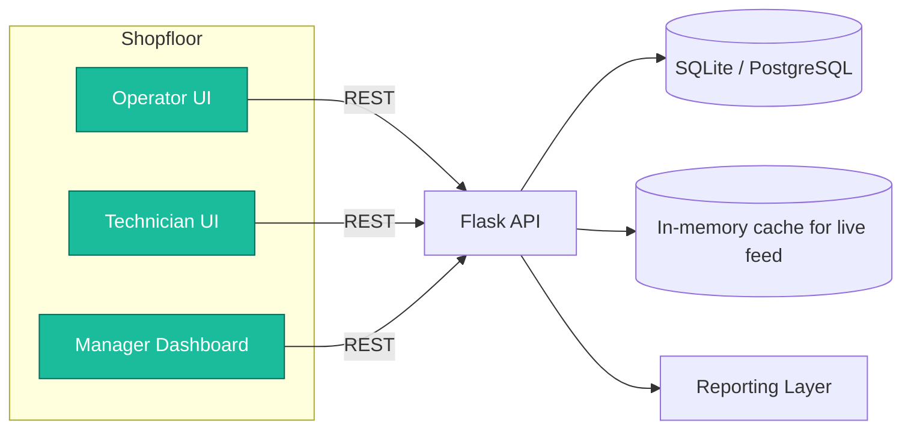
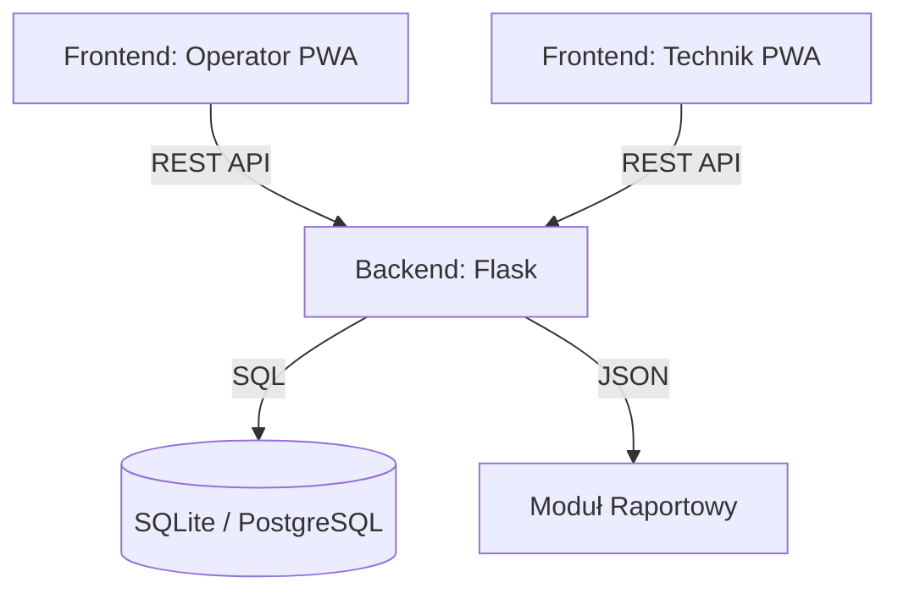

# 🏭 SmartFlow — Intelligent Production Reconfiguration Platform

> **Hackathon dla Małopolski 2025** · **Partner wyzwania:** ELPLC S.A. – _Inteligentny planer produkcji z dynamiczną rekonfiguracją_

<div align="center">
    
    
    
    
</div>

---

## 📚 Spis treści
1. [Executive Summary](#-executive-summary)
2. [Dlaczego wygramy wyzwanie ELPLC](#-dlaczego-wygramy-wyzwanie-elplc)
3. [Mapa interesariuszy i cele](#-mapa-interesariuszy-i-cele)
4. [Journeys użytkowników](#-journeys-użytkowników)
5. [Blueprint rozwiązania](#-blueprint-rozwiązania)
     - [Architektura systemu](#architektura-systemu)
     - [Moduły i odpowiedzialności](#moduły-i-odpowiedzialności)
     - [Feature Matrix](#feature-matrix)
6. [Dane & API Contract](#-dane--api-contract)
7. [Design System (UI/UX)](#-design-system-uiux)
8. [Dev Playbook](#-dev-playbook)
     - [Struktura repozytorium](#struktura-repozytorium)
     - [Setup i uruchomienie](#setup-i-uruchomienie)
     - [Guidelines inżynierskie](#guidelines-inżynierskie)
9. [Pitch & Demo Guide](#-pitch--demo-guide)
10. [Roadmapa, KPI i ryzyka](#-roadmapa-kpi-i-ryzyka)
11. [Appendix: Sample payloady](#-appendix-sample-payloady)

---

## 🚀 Executive Summary

**SmartFlow** to lekki, reaktywny ekosystem do zarządzania produkcją „w chwili zdarzenia”. Eliminujemy martwe strefy informacyjne między operatorem, technikiem i kierownikiem produkcji. System wykrywa przestoje w czasie rzeczywistym, automatycznie eskaluje je do właściwych osób i prowadzi operatorów przez proces dynamicznej rekonfiguracji planu.

**Cel na hackathon:** Pokażemy kompletne MVP działające na dwóch rolach (Operator, Technik) + panel kierownika oraz przedstawimy klarowną ścieżkę rozwoju do pełnego inteligentnego planera (AI scheduling, integracja z PLC).

---

## 🎯 Dlaczego wygramy wyzwanie ELPLC

| Kryterium ELPLC                   | SmartFlow (co dostarczamy)                                                                                                              |
| --------------------------------- | --------------------------------------------------------------------------------------------------------------------------------------- |
| Radzenie sobie z nagłymi zmianami | Mechanizm **One-Click Alert** i rejestr incydentów zmienia status maszyny w ciągu 3 sekund od zgłoszenia.                               |
| Dynamiczna rekonfiguracja         | Status maszyny wpływa na widok harmonogramu i pozwala ręcznie / półautomatycznie przekierować zlecenie. W roadmapie: auto-rescheduling. |
| Czytelność dla operatora          | Dashboard kafelkowy: zielony ≡ praca, żółty ≡ przezbrojenie/naprawa, czerwony ≡ awaria. Zero tabel, zero Exceli.                        |
| Predykcja dostępności             | Logujemy MTTR/MTBF, co tworzy bazę do predykcji awarii i scoringu maszyn.                                                               |
| Wdrażalność                       | Stack: Flask + SQLite + PWA → działa na każdym tablecie, zero licencji, minimalny CAPEX.                                                |

---

## 👥 Mapa interesariuszy i cele

| Persona                       | Ból                                                                        | Co im dajemy                                                        |
| ----------------------------- | -------------------------------------------------------------------------- | ------------------------------------------------------------------- |
| **Operator (Marek)**          | Musi zgłaszać awarie przez telefon/krzyk, traci czas na szukanie technika. | Jeden ekran z listą maszyn i czerwonym przyciskiem "Awaria".        |
| **Technik (Ania)**            | Chaos zgłoszeń, brak priorytetyzacji.                                      | Mobilny panel z kolejką według SLA + rejestrowanie czasu naprawy.   |
| **Kierownik produkcji (Ewa)** | Brak transparentności – dowiaduje się po fakcie.                           | Widok 360° hali + KPI (liczba incydentów, MTTR, dostępność maszyn). |
| **Zarząd / ELPLC**            | Szuka rozwiązania, które wejdzie szybko i pokaże ROI.                      | MVP działające w 48h plus roadmapa AI i integracji z PLC.           |

---

## 🧭 Journeys użytkowników

### 1. Operator – „Zgłoś i zapomnij”
1. Widzi kafelek `CNC-01` → klik `Zgłoś awarię`.
2. Wybiera typ (np. „Pęknięte narzędzie”), dodaje opis/zdjęcie.
3. SmartFlow oznacza maszynę jako 🔴 `AWARIA`, rejestruje timestamp i powiadamia techników.
4. Operator widzi status „Technik w drodze” (żółty) i może przejść na inne stanowisko.

### 2. Technik – „Priorytety, nie chaos”
1. Panel pokazuje kolejkę posortowaną wg SLA (priorytet × czas oczekiwania).
2. Techniczka przyjmuje zadanie (status `IN_PROGRESS`).
3. Po naprawie klika `Zakończ`. SmartFlow przywraca maszynę na `IDLE/WORKING` i loguje MTTR.

### 3. Kierownik – „Decyzje na danych”
1. Widzi, które zlecenia zatrzymały się z powodu awarii.
2. W razie dłuższej przerwy ręcznie przesuwa zlecenie na inną maszynę (w MVP manualnie, w roadmapie – AI).
3. Na koniec zmiany generuje raport (liczba incydentów, czas przestojów, ranking maszyn).

---

## 🏗️ Blueprint rozwiązania

### Architektura systemu



### Moduły i odpowiedzialności

| Moduł                   | Co robi                                                         | Status                             |
| ----------------------- | --------------------------------------------------------------- | ---------------------------------- |
| **Machine Monitor**     | Utrzymuje aktualny stan każdej maszyny (status, task, progres). | ✅ MVP                              |
| **Incident Engine**     | Rejestruje awarie, liczy SLA, aktualizuje statusy.              | ✅ MVP                              |
| **Technician Workflow** | Panel do przyjmowania i zamykania zgłoszeń.                     | ✅ MVP                              |
| **Manager Console**     | Widok 360° + manualne przesuwanie zleceń.                       | ⚙️ W trakcie (zielone kafle gotowe) |
| **AI Scheduler**        | Auto-rescheduling oparte na heurystykach + ML.                  | 🧭 Roadmapa                         |
| **PLC Connector**       | Integracja OPC-UA do danych maszynowych.                        | 🧭 Roadmapa                         |

### Feature Matrix

| Feature                | Operator | Technik | Kierownik     |
| ---------------------- | -------- | ------- | ------------- |
| Live status maszyn     | ✅        | ✅       | ✅             |
| Zgłaszanie awarii      | ✅        | ❌       | ✅ (view only) |
| Priorytety incydentów  | ❌        | ✅       | ✅             |
| Historia awarii (MTTR) | ✅        | ✅       | ✅ (z KPI)     |
| Re-konfiguracja zadań  | 🔜        | 🔜       | ✅ (manualnie) |
| Raport dzienny         | ❌        | ❌       | ✅             |

---

## 🗂️ Dane & API Contract

### Modele danych (SQL)

```sql
TABLE machines (
        id INTEGER PRIMARY KEY,
        name TEXT NOT NULL,
        status TEXT CHECK(status IN ('working','idle','error','maintenance')),
        current_task TEXT,
        progress INTEGER DEFAULT 0
);

TABLE incidents (
        id INTEGER PRIMARY KEY,
        machine_id INTEGER NOT NULL REFERENCES machines(id),
        description TEXT,
        status TEXT CHECK(status IN ('new','in_progress','resolved')) DEFAULT 'new',
        priority INTEGER DEFAULT 2, -- 1=Critical,2=High,3=Normal
        timestamp TEXT,
        resolved_at TEXT
);
```

### API Endpoints

| Method | Endpoint                   | Opis                                       | Odpowiedź                                  |
| ------ | -------------------------- | ------------------------------------------ | ------------------------------------------ |
| `GET`  | `/api/machines`            | Lista maszyn z aktualnym statusem.         | `[{id,name,status,current_task,progress}]` |
| `GET`  | `/api/incidents`           | Kolejka incydentów (sort DESC timestamp).  | `[{id,machine_id,priority,status,...}]`    |
| `POST` | `/api/report_incident`     | Zgłoszenie nowej awarii.                   | `{"success": true}`                        |
| `POST` | `/api/update_incident`     | Zmiana statusu (`in_progress`/`resolved`). | `{"success": true}`                        |
| `GET`  | `/api/metrics` _(roadmap)_ | KPI: MTTR, MTBF, liczba incydentów.        | `{"mttr": 11.2, ...}`                      |

**Przykładowy payload zgłoszenia:**

```json
{
    "machine_id": 2,
    "description": "Brak chłodziwa",
    "priority": 1
}
```

---

## 🎨 Design System (UI/UX)

1. **Kolory statusów:**
     - 🟢 `#2ECC71` – working
     - 🟡 `#F1C40F` – waiting/maintenance
     - 🔴 `#E74C3C` – error
     - 🔵 `#3498DB` – info/neutral
2. **Typografia:** `Inter` / fallback `Arial`, rozmiar min. 18 px na dashboardzie hali.
3. **Komponenty kluczowe:**
     - **Machine Tile**: status dot + nazwa + progress bar.
     - **Incident Card**: kolor priorytetu, czas oczekiwania, CTA (`Przyjmij`, `Zakończ`).
     - **Command Bar**: szybkie akcje (filtry, tryb nocny, toggle widoków).
4. **Accessibility:** kontrast WCAG AA, przyciski min. 48×48 px, etykiety w języku polskim i ikonografia intuicyjna.

---

## 🔧 Dev Playbook

### Struktura repozytorium

```text
internal-machine-monitor/
├── app.py
├── README.md
├── static/
│   ├── style.css
│   └── script.js
├── templates/
│   ├── operator.html
│   └── technician.html
└── database.db (auto)
```

### Setup i uruchomienie

```bash
git clone https://github.com/NetBr3ak/internal-machine-monitor.git
cd internal-machine-monitor
python -m venv .venv
.venv\Scripts\activate   # Windows
pip install flask
python app.py
```

Adresy:
* Operator: `http://localhost:5000/`
* Technik: `http://localhost:5000/technician`

### Guidelines inżynierskie

1. **Branching:** `main` (stabilny) + `feature/<module>`.
2. **Konwencje API:** snake_case w JSON, statusy jako stringi, brak polskich znaków w kluczach.
3. **Testy manualne:**
     - Zgłoszenie awarii → sprawdź, czy trafia na listę technika.
     - Zakończenie naprawy → maszyna wraca na `idle`.
4. **Observability:** loguj każde zgłoszenie i zamknięcie incydentu (print/logging) – potrzebne w demie.

---

## 🎤 Pitch & Demo Guide

### 6-slidowy deck (proponowany układ)
1. **Problem** – zdjęcie hali, cytat operatora.
2. **Rozwiązanie** – screenshot kafelków + hasło „Reakcja w 30 sekund”.
3. **Jak działa** – diagram przepływu (Operator → SmartFlow → Technik → Kierownik).
4. **Korzyści** – tabela ROI (MTTR ↓ 40%, OEE ↑ 5 pp, oszczędność 3 h/dzień).
5. **Roadmapa** – AI scheduler, integracja PLC, predictive maintenance.
6. **Zespół & Call-to-action** – kto za co odpowiada, co potrzebujemy od jury.

### Live demo (5 min)
1. Start: pokaz zielonego dashboardu (Operator view).
2. Klik `Awaria` → natychmiastowy czerwony kafelek.
3. Przełącz na panel technika → nowe zgłoszenie na górze.
4. „Rozpocznij naprawę” → status żółty.
5. „Zakończ” → wszystko wraca na zielono; pokaż, że w historii zapisała się długość przestoju.

### Q&A cheat-sheet
| Pytanie jury                       | Nasza odpowiedź                                                                                                         |
| ---------------------------------- | ----------------------------------------------------------------------------------------------------------------------- |
| „Co z integracją z ERP?”           | REST hooks / CSV import – mamy zdefiniowane kontrakty, można wykorzystać API SAP/Comarch.                               |
| „Jak skalowalne jest rozwiązanie?” | Flask + PostgreSQL bez problemu obsłużą kilkaset maszyn; w roadmapie konteneryzacja i WebSockets.                       |
| „Dlaczego wygra ROI?”              | Każda minuta przestoju CNC to ~500 zł. Skracamy przestoje o min. 15 min/dzień/linia → 7 500 zł tygodniowo oszczędności. |

---

## 🛣️ Roadmapa, KPI i ryzyka

### KPI (mierzymy od razu)
* `MTTR` – < 15 min (benchmark: 25-30 min).
* `First Response Time` – < 2 min.
* `# Awarie / zmiana` – spadek dzięki lepszej prewencji.

### Roadmapa
| Kwartal | Funkcja                | Opis                                                             |
| ------- | ---------------------- | ---------------------------------------------------------------- |
| Q4 2025 | MVP                    | Operator + Technik + Historia incydentów.                        |
| Q1 2026 | AI Scheduler           | Heurystyka + algorytm genetyczny do rekonfiguracji.              |
| Q2 2026 | IoT Adapter            | Moduł OPC UA + dashboard parametrów (temp./wibracje).            |
| Q3 2026 | Predictive Maintenance | Model ML przewidujący awarie na podstawie timeline’u incydentów. |

### Ryzyka & mitigacje
| Ryzyko                        | Mitigacja                                               |
| ----------------------------- | ------------------------------------------------------- |
| Brak danych historycznych     | Seedujemy dane przykładowe + przewidujemy import CSV.   |
| Opór operatorów               | UX jak kiosk, zero logowania. Przyciski duże, język PL. |
| Integracja z systemami legacy | REST-first, brak vendor lock-in, fallback CSV.          |

---

## 📎 Appendix: Sample payloady

```http
POST /api/report_incident
Content-Type: application/json

{
    "machine_id": 4,
    "description": "Awaria czujnika położenia",
    "priority": 1
}
```

```http
POST /api/update_incident
Content-Type: application/json

{
    "id": 7,
    "status": "resolved"
}
```

---

<div align="center">
    <b>SmartFlow Team — „Bo każda minuta przestoju ma znaczenie.”</b>
</div>
# 🏭 SmartFlow: Intelligent Production Reconfiguration System

> **Projekt na Hackathon dla Małopolski 2025**  
> **Wyzwanie:** ELPLC S.A. — Inteligentny planer produkcji z dynamiczną rekonfiguracją

<div align="center">
  
  
  
  
</div>

---

## 📑 Spis Treści
- [🏭 SmartFlow — Intelligent Production Reconfiguration Platform](#-smartflow--intelligent-production-reconfiguration-platform)
	- [📚 Spis treści](#-spis-treści)
	- [🚀 Executive Summary](#-executive-summary)
	- [🎯 Dlaczego wygramy wyzwanie ELPLC](#-dlaczego-wygramy-wyzwanie-elplc)
	- [👥 Mapa interesariuszy i cele](#-mapa-interesariuszy-i-cele)
	- [🧭 Journeys użytkowników](#-journeys-użytkowników)
		- [1. Operator – „Zgłoś i zapomnij”](#1-operator--zgłoś-i-zapomnij)
		- [2. Technik – „Priorytety, nie chaos”](#2-technik--priorytety-nie-chaos)
		- [3. Kierownik – „Decyzje na danych”](#3-kierownik--decyzje-na-danych)
	- [🏗️ Blueprint rozwiązania](#️-blueprint-rozwiązania)
		- [Architektura systemu](#architektura-systemu)
		- [Moduły i odpowiedzialności](#moduły-i-odpowiedzialności)
		- [Feature Matrix](#feature-matrix)
	- [🗂️ Dane \& API Contract](#️-dane--api-contract)
		- [Modele danych (SQL)](#modele-danych-sql)
		- [API Endpoints](#api-endpoints)
	- [🎨 Design System (UI/UX)](#-design-system-uiux)
	- [🔧 Dev Playbook](#-dev-playbook)
		- [Struktura repozytorium](#struktura-repozytorium)
		- [Setup i uruchomienie](#setup-i-uruchomienie)
		- [Guidelines inżynierskie](#guidelines-inżynierskie)
	- [🎤 Pitch \& Demo Guide](#-pitch--demo-guide)
		- [6-slidowy deck (proponowany układ)](#6-slidowy-deck-proponowany-układ)
		- [Live demo (5 min)](#live-demo-5-min)
		- [Q\&A cheat-sheet](#qa-cheat-sheet)
	- [🛣️ Roadmapa, KPI i ryzyka](#️-roadmapa-kpi-i-ryzyka)
		- [KPI (mierzymy od razu)](#kpi-mierzymy-od-razu)
		- [Roadmapa](#roadmapa)
		- [Ryzyka \& mitigacje](#ryzyka--mitigacje)
	- [📎 Appendix: Sample payloady](#-appendix-sample-payloady)
- [🏭 SmartFlow: Intelligent Production Reconfiguration System](#-smartflow-intelligent-production-reconfiguration-system)
	- [📑 Spis Treści](#-spis-treści-1)
	- [🚀 Wstęp i Wizja](#-wstęp-i-wizja)
	- [🎯 Analiza Wyzwania ELPLC](#-analiza-wyzwania-elplc)
	- [🎤 Dla Prezenterów (Pitch Deck)](#-dla-prezenterów-pitch-deck)
		- [Storytelling](#storytelling)
		- [Scenariusz Demo](#scenariusz-demo)
		- [Wartość Biznesowa (ROI)](#wartość-biznesowa-roi)
		- [FAQ dla Jury](#faq-dla-jury)
	- [💻 Dla Deweloperów (Tech Guide)](#-dla-deweloperów-tech-guide)
		- [Architektura Systemu](#architektura-systemu-1)
		- [Struktura Projektu](#struktura-projektu)
		- [Baza Danych](#baza-danych)
		- [API Documentation](#api-documentation)
		- [Instalacja i Setup](#instalacja-i-setup)
	- [🎨 Design System (UI/UX)](#-design-system-uiux-1)
	- [🗺️ Roadmapa Rozwoju](#️-roadmapa-rozwoju)
		- [Faza 1: MVP (Obecna)](#faza-1-mvp-obecna)
		- [Faza 2: Smart Logic (Hackathon Day 2)](#faza-2-smart-logic-hackathon-day-2)
		- [Faza 3: Future (Post-Hackathon)](#faza-3-future-post-hackathon)

---

## 🚀 Wstęp i Wizja

**"Plany produkcyjne są idealne tylko do momentu uruchomienia pierwszej maszyny."**

W nowoczesnym przemyśle (Industry 4.0) statyczne harmonogramy w Excelu to przeżytek. Awaria jednej kluczowej maszyny potrafi zburzyć plan całego dnia, powodując kaskadowe opóźnienia.

**SmartFlow** to system klasy **Dynamic Shopfloor Control**, który zmienia paradygmat zarządzania produkcją. Zamiast sztywno trzymać się planu, dajemy narzędzie, które **aktywnie reaguje na zakłócenia**.

**Nasza misja:** Skrócenie czasu reakcji na awarię z minut do sekund i automatyzacja decyzji o zmianie planu.

---

## 🎯 Analiza Wyzwania ELPLC

Partner wyzwania, **ELPLC S.A.**, zdefiniował konkretne problemy. Oto jak SmartFlow je rozwiązuje:

| Problem / Wyzwanie                      | Rozwiązanie SmartFlow                                                                                                                                 |
| :-------------------------------------- | :---------------------------------------------------------------------------------------------------------------------------------------------------- |
| **"Nagłe zmiany (awarie, opóźnienia)"** | System **One-Click Alert** pozwala operatorowi zgłosić problem w 3 sekundy. Status maszyny zmienia się natychmiast w całym systemie.                  |
| **"Dynamiczna rekonfiguracja"**         | Gdy maszyna wypada z gry, system automatycznie oznacza ją jako `UNAVAILABLE`. W przyszłych wersjach AI zaproponuje alternatywną ścieżkę dla zlecenia. |
| **"Czytelna forma dla operatora"**      | Zastąpiliśmy skomplikowane tabele **Wizualnym Dashboardem Kafelkowym**. Kolor mówi wszystko: 🟢 Działa, 🔴 Stoi.                                        |
| **"Predykcja dostępności"**             | Zbieramy dokładne dane o czasach awarii (timestampy), co pozwala liczyć MTTR (Mean Time To Repair) i budować modele predykcyjne.                      |

---

## 🎤 Dla Prezenterów (Pitch Deck)

Ta sekcja zawiera kluczowe informacje potrzebne do wygrania prezentacji przed Jury.

### Storytelling
Zacznij od historii:
> *"Wyobraźcie sobie Marka. Marek jest operatorem CNC. Jest 14:00, piątek. Maszyna staje. Marek szuka kierownika. Kierownik jest na spotkaniu. Marek szuka technika. Technik jest na przerwie. Mija 20 minut. Produkcja stoi. Nikt nie wie, co się dzieje.*
>
> *Teraz wyobraźcie sobie SmartFlow. Maszyna staje. Marek klika jeden czerwony przycisk na tablecie. Technik dostaje powiadomienie na smartwatcha. Kierownik widzi czerwoną lampkę na dashboardzie i przesuwa zlecenie na inną maszynę. Czas reakcji? 30 sekund."*

### Scenariusz Demo
Podczas prezentacji pokaż przepływ "na żywo" (wymaga dwóch okien przeglądarki lub telefonu i laptopa):

1.  **Ekran 1 (Operator)**: Pokaż zielone kafelki. "Produkcja idzie zgodnie z planem."
2.  **Akcja**: Kliknij "ZGŁOŚ AWARIĘ" na maszynie CNC-01. Wybierz "Awaria narzędzia".
3.  **Efekt**: Kafelek zmienia się na CZERWONY.
4.  **Ekran 2 (Technik)**: Odśwież/Pokaż listę. "Technik widzi nowe zgłoszenie na górze listy."
5.  **Akcja**: Technik klika "ROZPOCZNIJ NAPRAWĘ".
6.  **Ekran 1 (Operator)**: Status zmienia się na ŻÓŁTY (W naprawie). "Operator wie, że pomoc jest w drodze."
7.  **Akcja**: Technik klika "ZAKOŃCZ". Maszyna wraca na ZIELONO.

### Wartość Biznesowa (ROI)
Dlaczego firma ma za to zapłacić?
1.  **Wzrost OEE (Overall Equipment Effectiveness)**: Mniej mikro-przestojów wynikających z braku komunikacji.
2.  **Redukcja MTTR (Mean Time To Repair)**: Szybszy przepływ informacji = szybsza naprawa.
3.  **Data-Driven Decisions**: Koniec z "wydaje mi się". Mamy twarde dane, która maszyna psuje się najczęściej.

### FAQ dla Jury
*   **P: Czy to działa z systemami ERP?**
    *   O: Tak, architektura jest otwarta. Możemy pobierać zlecenia z SAP/Comarch przez API.
*   **P: Co jeśli padnie internet?**
    *   O: Aplikacja jest PWA (Progressive Web App), cache'uje dane lokalnie i synchronizuje się po powrocie sieci.
*   **P: Jak to wdrożyć na starej hali?**
    *   O: Nie wymaga drogiej infrastruktury. Wystarczy tablet za 500 zł przy maszynie lub prywatny telefon operatora.

---

## 💻 Dla Deweloperów (Tech Guide)

Szczegóły techniczne niezbędne do rozwoju i utrzymania projektu.

### Architektura Systemu
System oparty jest o architekturę **Klient-Serwer** z lekkim backendem REST API.



### Struktura Projektu
```text
/hackaton
├── app.py                 # Główny plik aplikacji (Server & Routes)
├── database.db            # Plik bazy danych (tworzony automatycznie)
├── static/
│   ├── style.css          # Style (CSS Variables, Flexbox/Grid)
│   └── script.js          # Logika frontendowa (Fetch API, DOM Manipulation)
├── templates/
│   ├── operator.html      # Widok dla produkcji
│   └── technician.html    # Widok dla utrzymania ruchu
└── README.md              # Dokumentacja
```

### Baza Danych
Schemat relacyjny (SQL):

**Tabela `machines`** (Stan bieżący)
| Kolumna        | Typ     | Opis                                      |
| :------------- | :------ | :---------------------------------------- |
| `id`           | INTEGER | PK                                        |
| `name`         | TEXT    | Nazwa gniazda (np. "CNC-01")              |
| `status`       | TEXT    | `working`, `idle`, `error`, `maintenance` |
| `current_task` | TEXT    | ID lub nazwa zlecenia                     |
| `progress`     | INTEGER | Procent wykonania (0-100)                 |

**Tabela `incidents`** (Historia zdarzeń)
| Kolumna       | Typ      | Opis                                    |
| :------------ | :------- | :-------------------------------------- |
| `id`          | INTEGER  | PK                                      |
| `machine_id`  | INTEGER  | FK -> machines.id                       |
| `description` | TEXT     | Opis awarii wybrany z listy lub wpisany |
| `status`      | TEXT     | `new`, `in_progress`, `resolved`        |
| `timestamp`   | DATETIME | Czas zgłoszenia                         |

### API Documentation

**1. Pobierz status maszyn**
*   `GET /api/machines`
*   Response: `[{"id": 1, "name": "CNC-01", "status": "working", ...}, ...]`

**2. Pobierz listę awarii**
*   `GET /api/incidents`
*   Response: `[{"id": 1, "description": "Awaria silnika", "status": "new", ...}, ...]`

**3. Zgłoś awarię**
*   `POST /api/report_incident`
*   Body: `{"machine_id": 1, "description": "Brak materiału"}`

**4. Aktualizuj status awarii**
*   `POST /api/update_incident`
*   Body: `{"id": 12, "status": "resolved"}`
*   *Logic*: Jeśli status to `resolved`, maszyna automatycznie wraca do statusu `idle`.

### Instalacja i Setup

1.  **Wymagania**: Python 3.8+
2.  **Instalacja zależności**:
    ```bash
    pip install flask
    ```
3.  **Uruchomienie**:
    ```bash
    python app.py
    ```
    Serwer wystartuje na `http://127.0.0.1:5000`.

---

## 🎨 Design System (UI/UX)

Projektujemy pod presją czasu i w trudnych warunkach oświetleniowych hali.

**Zasady:**
1.  **High Contrast**: Tekst musi być czytelny z 2 metrów.
2.  **Touch First**: Przyciski muszą mieć min. 48x48px (standard Google Material).
3.  **Color Coding**:
    *   🟢 **#2ecc71 (Emerald)**: Wszystko OK.
    *   🟡 **#f1c40f (Sunflower)**: Ostrzeżenie / W trakcie pracy.
    *   🔴 **#e74c3c (Alizarin)**: Błąd krytyczny / Stop.
    *   🔵 **#3498db (Peter River)**: Informacja / Neutralny.

---

## 🗺️ Roadmapa Rozwoju

### Faza 1: MVP (Obecna)
*   [x] Podstawowy monitoring maszyn.
*   [x] Zgłaszanie awarii.
*   [x] Panel technika.

### Faza 2: Smart Logic (Hackathon Day 2)
*   [ ] **Auto-Rescheduling**: Gdy awaria > 2h, system sugeruje przeniesienie zlecenia na bliźniaczą maszynę.
*   [ ] **Push Notifications**: Web Push API do powiadomień na telefonie technika.

### Faza 3: Future (Post-Hackathon)
*   [ ] **Integracja IoT**: Podpięcie pod sterowniki PLC (Siemens/Mitsubishi) przez OPC UA.
*   [ ] **AI Predictive Maintenance**: Analiza historyczna do przewidywania awarii.

---

<div align="center">
  <b>SmartFlow Team</b><br>
  <i>Hackathon dla Małopolski 2025</i>
</div>
